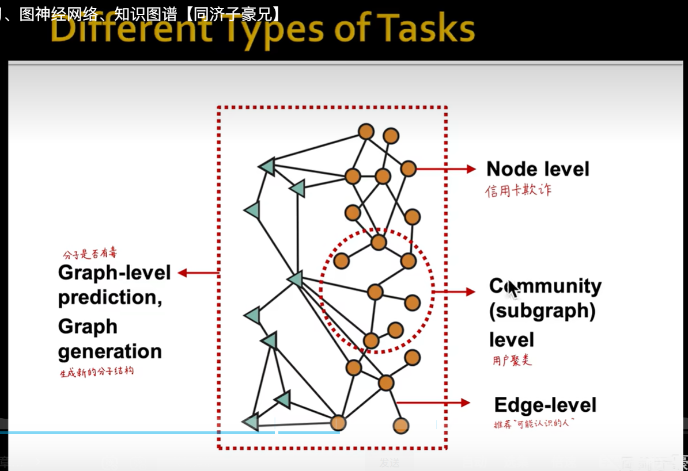

# 知识图谱推理论文

**论文：Towards knowledge graph reasoning for supply chain risk management using graph neural networks_供应商风险管理**（特别重点）

**关键字：**

supply chain risk management（SCRM）供应链风险管理

neural networks 神经网络

knowledge graph 知识图谱

Digital Supply Chain Risk Surveillance (DSCRS) 数字化供应链风险监控

link prediction methods 链接预测方法

Q&A system 问答系统

Social Networks 社交网络

**总结：**

解决的问题：1、unwillingness of suppliers to share data 供应商不愿意共享数据（信息不对称）

​                       2、supply chain complexity  供应链复杂（复杂网络可视化）

数据集（知识图谱）包含五种类型的实体:公司、国家、认证、产品和能力

采用GNN（图神经网络）+知识图谱 =>知识图谱补全  可以实现预测补全后的问答，实现风险的查询和管理


**论文：《基于知识图谱的企业风险预警系统的设计与实现》+《基于企业股权关系知识图谱的制造业信用风险传染分析》**

总结：用知识图谱构建网络，用概率模型模仿容量-负载过程，最后可视化可以节点不同颜色并标注概率，表示出演化过程。


**论文：《融合知识图谱与神经网络赋能数智化管理决策》**


# 大模型+构建知识图谱+图谱推理关键字

**1、大模型 生成**

​       知识图谱   逻辑结构

**2、大模型：多模态 【多模态大模型-报告9月24日】**

  创新：1、graphrag  

​              2、cilp、bilp、ALBEF   vit、感知层：MLP、Qformer、coress-attention

**3、构建知识图谱：**

   图谱抽取： pipeline和端到端joint

​                       流水线：bert+bilstm_crf

​                        joint:casrel                        

   实体抽取、关系抽取

   事件抽取

   实体融合：（跨谱）实体对齐、实体消歧、指代消歧

​                         有监督：词典词袋

​                          半监督或蒸馏学习：一部分有标注，另一部分自己学习 

​    可视化：neo4j	

​    **AI大模型构建知识图谱：UIE框架**

​    参考：https://blog.csdn.net/xs1997/article/details/125061428（知识图谱构建流程步骤详解）


**4、知识图谱推理**

实体链接（图谱补全）：推荐发现、演化预测


# 复杂网络+社交网络+图神经网络关键字

**1、网络演化预测：**针对**社交网络分析**目前是学术主流

**2、网络韧性：**TDNetGen: Empowering Complex Network Resilience Prediction with Generative Augmentation of Topology and Dynamics【KDD 2024】基于拓扑与动力学生成式数据增强的复杂网络系统韧性预测

**3、图神经网络能解决的问题**



**4、洪流 复旦大学（共计5篇）**


# （供应链）数据分析与管理（大模型应用）关键字

**1、需求预测&库存管理（计划、决策）：**阿里云供应链大赛 - 给出：历史需求数据，需求预测、库存管理

**2、订购采购策略：**

**3、供应链管理常规知识体系：**

需求预测：需求预测前置问题（采购管理、库存管理、销售管理）

采购管理：供应商选择、成本计算

库存管理：需求确定、需求不确定、安全库存

销售管理：定价策略、销量预测

分销与物流管理：物流相关研究

**优选库存管理**

**4、前沿供应链研究方向：**

复杂网络：复杂供应链网络

供应链合作与协同：略

安全策略与韧性提升：借鉴材料力学中韧性的概念,认为供应链韧性也包括弹性和塑性两个阶段:弹性阶段是 在现有供应链网络结构没有发生变化的情况下,可 以通过一些库存或者通过一些额外的产能,抵消部 分供应链面临的风险;而塑性阶段是供应链网络进 行重组,以吸收更多的风险。可见,供应链安全与韧 性的本质要求是相通的,供应链韧性是供应链安全 的本质要求。


# UTD24

查询公式：管科TOP5+信管TOP3+informs旗下管科、信管、制造服务、交通=15本期刊

```
(ALL=(LLM* OR large language model)) and(so=(Operations Research OR Management Science OR Journal of Operations Management OR Manufacturing and service Operations Management OR Production and Operations Management OR Information Systems Research OR Journal of Computing OR MIS Ouarterly OR INFORMS Journal on Computing OR Information Systems Research OR Decision Analysis OR Manufacturing & Service Operations Management OR Mathematics of Operations Research OR Transportation Science))
```


关键字：knowledge graph*    2018-2024   查询结果共计14篇,真正匹配0篇,有价值2篇。

```
How to Calculate the Barycenter of a Weighted Graph 如何计算加权图的重心（有点用）

Learning to Rank in Entity Relationship Graphs 学习实体关系图中的排序（有点用）

Growing Technological Relatedness to the ICT Industry and Its Impacts ICT行业的技术相关性日益增强及其影响（没用）

Generating Random Networks Without Short Cycles 生成无短周期的随机网络（复杂网络相关）

Seeding with Costly Network Information 用昂贵的网络信息播种（有点用）

Matching Impatient and Heterogeneous Demand and Supply 匹配不耐烦和异质的需求和供应（没用）

PYJEDAI: A Library with Resolution-Related Structures and Procedures for
Products    PYJEDAI：一个具有分辨率相关结构和程序的图书馆产品

Optimal Nonlinear Pricing in Social Networks Under Asymmetric Network
Information  非对称网络下社交网络的最优非线性定价问询处（重点）

Impact of Network Structure on New Service Pricing 网络结构对新服务定价的影响

Designing Approximately Optimal Search on Matching Platforms 在匹配平台上设计近似最优搜索

The Online Shortest Path Problem: Learning Travel Times Using a 
Multiarmed Bandit Framework   在线最短路径问题：使用多武装土匪组织

A machine learning approach to deal with ambiguity in the humanitarian
decision-making  一种处理人道主义中模糊性的机器学习方法决策

A Large-Scale Comparative Study of Informal Social Networks in Firms 企业非正式社交网络的大规模比较研究

CSDN：是Yu欸 博主关注图神经网络、复杂网络等。
```

关键字：LLM*    2024起始   查询结果共计4篇,真正匹配2篇，均2024年度,有价值2篇。

```
the-bullwhip-effect-in-servitized-manufacturers  服务化制造商的牛鞭效应(需求预测)

From Feeds to Inboxes: A Comparative Study of Polarization in Facebook and Email News Sharing   从订阅源到收件箱：脸书和电子邮件新闻共享两极分化的比较研究(重点)
```

关键字：neural network   2021-2024   查询结果共计83篇,从2021年起每年20篇左右。

太多了，不总结了。

关键字：graph neural network OR GNN OR GCN   2021-2024 查询结果共计9篇，真正匹配9篇，有价值9篇。

期刊：INFORMS Journal on Computing、Information Systems Research、Transportation Science均发表在这3本期刊上，图神经网络在复杂网络、社交网络、城市交通网络中有潜在价值。2024年4篇，2022年3篇。

```
TI A Graph-Based Approach for Relating Integer Programs TI一种基于图的整数程序关联方法

TI Inductive Representation Learning on Dynamic Stock Co-Movement Graphs 
for Stock Predictions   TI动态股票共同运动图的归纳表示学习用于股票预测（重点）

TI Detecting Bots and Assessing Their Impact in Social Networks TI检测机器人并评估其在社交网络中的影响

TI A Neural Separation Algorithm for the Rounded Capacity Inequalities TI——一种求解舍入容量不等式的神经分离算法

TI Diversity Preference-Aware Link Recommendation for Online Social
Networks  TI在线社交多样性偏好感知链接推荐网络（重点）

TI Hybrid Value Function Approximation for Solving the Technician Routing
Problem with Stochastic Repair Requests TI混合值函数近似求解技术人员路线随机修复请求的问题

TI Genetic Algorithms with Neural Cost Predictor for Solving Hierarchical
Vehicle Routing Problems TI遗传算法与神经成本预测器求解分层问题车辆路线问题

TI Deep Learning of Spatiotemporal Patterns for Urban Mobility Prediction
Using Big Data  TI用于城市交通预测的时空模式深度学习使用大数据

TI A Cost-Effective Sequential Route Recommender System for Taxi Drivers TI一种经济高效的出租车司机顺序路线推荐系统（重点）

```

关键字：ALL=(multimodal AND deep learning)  2024  共计1篇，有价值1篇。

```
attending-to-customer-attention-a-novel-deep-learning-method-for-leveraging-multimodal-online-reviews
关注客户注意力：一种新的杠杆化深度学习方法多模式在线评论
```

**由于大模型和多模态的文献过于少，扩大搜索范围=>假设不限定期刊。**

```
ALL=(multimodal AND deep learning)  选择领域：operations research management science
共计 91篇 该领域7篇综述->意义不大 期刊论文71篇（高质量：54+3+3，OR&MANSCI 3篇）

有价值统计：
【ANNALS OF OPERATIONS RESEARCH 运筹学年鉴】：Heat source layout optimization using automatic deep learning surrogate and multimodal neighborhood search algorithm
热源布局优化使用自动深学习代理和多模态邻域搜索算法（重点）

【EXPERT SYSTEMS WITH APPLICATIONS 具有应用程序的专家系统】：Capsule network-based deep ensemble transfer learning for multimodal sentiment analysis
基于胶囊网络的深度集成迁移学习的多模态情绪分析

【JOURNAL OF MANUFACTURING SYSTEMS 制造系统杂志】：A multi-branch deep neural network model for failure prognostics based on multimodal data
基于多模态数据的多分支深度神经网络模型

【EXPERT SYSTEMS WITH APPLICATIONS 具有应用程序的专家系统】：Multimodal deep learning water level forecasting model for multiscale drought alert in Feiyun River basin
飞云河流域多尺度干旱预警的多模式深度学习水位预测模型（类似的非常多）

EXPERT SYSTEMS WITH APPLICATIONS期刊共计54篇 信息管理领域期刊ABS3星
ANNALS OF OPERATIONS RESEARCH期刊共计3篇 运筹管理领域期刊ABS3星
JOURNAL OF MANUFACTURING SYSTEMS期刊共计3篇 运营与科技领域期刊ABS1星

【ANNALS OF OPERATIONS RESEARCH 运筹学年鉴】：A decision support system in precision medicine: contrastive multimodal learning for patient stratification
精准医学中的决策支持系统：患者分层的对比多模态学习（重点）

【ANNALS OF OPERATIONS RESEARCH 运筹学年鉴】：Reconciling spatiotemporal conjunction with digital twin for sequential travel time prediction and intelligent routing
协调时空结合与数字双胞胎，用于顺序旅行时间预测和智能路由（重点）

```

```
ALL=(LLM* OR MLLM*) 选择领域：operations research management science
共计 68篇 该领域2篇综述 ；期刊论文57篇（高质量：2+2+2，16+3+4+3=54，OR&MANSCI 6篇）

EXPERT SYSTEMS WITH APPLICATIONS  INFO MAN 16篇（重要期刊） 
JOURNAL OF MANUFACTURING SYSTEMS OPS&TECH 4篇 ABS1星
INFOR: Information Systems and Operational Research OR&MANSCI 3篇 ABS1星
Decision Support Systems INFO MAN 3篇 ABS3星（重要期刊） 
ANNALS OF OPERATIONS RESEARCH OR&MANSCI  2篇 ABS3星（重要期刊）
European Journal of Operational Research OR&MANSCI ABS4星 2篇（重要期刊）
MS ABS4星 2篇

统计AOR和EJOR共计4篇：比MS2篇更重要和贴切
Natural language processing analysis of online reviews for small business: extracting insight from small corpora（重点）

A new hybrid classification algorithm for customer churn prediction based on logistic regression and decision trees（重点）

Adjustment costs in the technical efficiency: An application to global banking（重点）

A framework for identifying the falsified financial statements using network textual analysis: a general model and the Greek example（重点）

```

```
ALL=(knowledge graph*) 选择领域：operations research management science
共计500余篇

搜索一篇The lean and resilient management of the supply chain and its impact on performance
供应链的精益和弹性管理及其对绩效的影响（重点）
```


EXPERT SYSTEMS WITH APPLICATIONS 288篇 ABS3星
JOURNAL OF MANUFACTURING SYSTEMS 24篇  ABS1星
NTERNATIONAL JOURNAL OF PRODUCTION RESEARCH OPS&TECH 18篇 ABS3星（重要期刊）  
ANNALS OF OPERATIONS RESEARCH 11篇 ABS3星
International Journal of Computer Integrated Manufacturing OPS&TECH 6篇 ABS2星
Decision Support Systems INFO MAN 4篇 ABS3星
International Journal of Technology Management OPS&TECH 1篇 ABS2星 
Journal of Optimization Theory and Applications OR&MANSCI 1篇 ABS3星
International Transactions in Operational Research OR&MANSCI 1篇 ABS1星
International Journal of Production Economics OPS&TECH 1篇 ABS3星
Transportation Science OR&MANSCI 1篇 ABS3星
Manufacturing and Service Operations Management、M&SOM-MANUFACTURING & SERVICE OPERATIONS MANAGEMENT  OPS&TECH 1篇 ABS3星
OMEGA-INTERNATIONAL JOURNAL OF MANAGEMENT SCIENCE 1篇 ABS3星


# 供应链风险管理

**网络传播**

大规模不均衡担保网络风险传播预测的方法研究-程大伟  深度学习

多式联运网络风险评估、传播与控制研究-郭静妮 物流管理

供应链上关联信用风险传染效应与评价研究-谢小凤  管科

供应链突发风险传染机理与控制策略研究-王世雄 管科

期刊：

供应链风险传播BSＲ－ＲP模型仿真研究  -传染病 

基于马尔可夫与传染病模型的供应链网络中断风险传播研究 -传染病

考虑间接关系的R&D网络风险传播规律研究  -网络建模


**知识图谱**

面向航天制造企业的供应链知识图谱研究与智能辅助分析示范建设

极端天气条件下风电机组事故演化知识图谱的构建及分析

突发事件的应急知识表示与知识推理研究

威胁情报知识图谱构建与应用关键技术研究 

土木工程施工工人安全知识智能推荐研究

融合知识图谱与神经网络赋能数智化管理决策（重点）

突发事件下社交媒体网络舆情风险识别及预警模型研究（重点）


## YOLO

1、卷积+网址md文档

```
## 网址

​```
1、PCB Defects数据集
https://www.kaggle.com/datasets/akhatova/pcb-defects 

2、检测头篇 | YOLOv8 添加 大目标检测头 | 小目标检测头 | 4头BiFPN
https://blog.csdn.net/weixin_43694096/article/details/130296569

3、小目标检测篇 | YOLOv8改进之增加小目标检测层（四头检测机制）
https://blog.csdn.net/weixin_61961691/article/details/136985479

4、《YOLOv8改进实战专栏》专栏介绍 & 专栏目录 《提供 YOLOv8-Magic 私域代码框架/本人7次贡献过YOLOv8官方项目》
https://yolov5.blog.csdn.net/article/details/130671688

5、YOLOv8改进有效系列目录 | 包含卷积、主干、检测头、注意力机制、Neck上百种创新机制
https://snu77.blog.csdn.net/article/details/135309007    带QQ群

6、超详解| Yolov8模型手把手调参 | 配置 | 模型训练 | 验证 | 推理
https://blog.csdn.net/xu1129005165/article/details/132720801

7、Yolov8网络模型改进之添加SKAttention
https://www.bilibili.com/video/BV1Gz421D7ps/?spm_id_from=333.788&vd_source=0ffd96b505a7a6c542465122b51adff3


8、YOLOV8改进：在C2f模块不同位置添加注意力机制
https://blog.csdn.net/m0_51530640/article/details/129458744?ops_request_misc=%257B%2522request%255Fid%2522%253A%2522172170687916800227410690%2522%252C%2522scm%2522%253A%252220140713.130102334.pc%255Fall.%2522%257D&request_id=172170687916800227410690&biz_id=0&utm_medium=distribute.pc_search_result.none-task-blog-2~all~first_rank_ecpm_v1~rank_v31_ecpm-20-129458744-null-null.142^v100^pc_search_result_base1&utm_term=c2f%E6%A8%A1%E5%9D%97%E6%94%B9%E8%BF%9B&spm=1018.2226.3001.4187

9、YOLOv8改进 | 注意力机制 | RCS-OSA替换C2f实现暴力涨点（减少通道的空间对象注意力机制）
https://snu77.blog.csdn.net/article/details/134865182

10、YOLOv8改进 添加CVPR2024 PKINet中注意力机制CAAttention
https://blog.csdn.net/zmyzcm/article/details/140170894?ops_request_misc=%257B%2522request%255Fid%2522%253A%2522172170601116800211546576%2522%252C%2522scm%2522%253A%252220140713.130102334..%2522%257D&request_id=172170601116800211546576&biz_id=0&utm_medium=distribute.pc_search_result.none-task-blog-2~all~sobaiduend~default-1-140170894-null-null.142^v100^pc_search_result_base1&utm_term=%E4%B8%8A%E4%B8%8B%E6%96%87%E9%94%9A%E7%82%B9%E6%B3%A8%E6%84%8F%E5%8A%9B%EF%BC%88CAA%EF%BC%89&spm=1018.2226.3001.4187
​```


阿里网盘

C:\Users\lichenyang\Downloads


1、换底版
2、换颜色
3、切图

北大 测试


https://support.huaweicloud.com/bestpractice-cce/cce_bestpractice_00198.html


6个角度

小目标检测头 P2  完成

特征融合BiFPN  完成

https://yolov5.blog.csdn.net/article/details/130651136


卷积核修改 conv

https://snu77.blog.csdn.net/article/details/135309007


C2F修改

https://yolov5.blog.csdn.net/article/details/130624384


网络结构 注意力机制

https://snu77.blog.csdn.net/article/details/135052550

https://blog.csdn.net/weixin_43694096/article/details/134275483


损失函数

https://snu77.blog.csdn.net/article/details/134609358


调参

https://yolov5.blog.csdn.net/article/details/132629332

优化器、学习率、损失函数


0714

https://snu77.blog.csdn.net/article/details/135074998   检测头

卷积或注意力机制  二选一

损失函数优化


## 大图小目标检测

​```
[遥感数据集]11个遥感图像数据集推荐
https://zhuanlan.zhihu.com/p/529256324

基于整体学习的大幅面超高分遥感影像桥梁目标检测！（含数据集下载地址）
https://www.bilibili.com/read/cv36052994/?jump_opus=1

复现总结---YOLTv4：改进的卫星图像目标检测
https://zhuanlan.zhihu.com/p/541180383

AI之路——YOLT算法笔记
https://blog.csdn.net/u014380165/article/details/81556805

【文献阅读】YOLT算法实现遥感图像的多尺度目标识别（Adam Van Etten，2018，CVPR）
https://blog.csdn.net/z704630835/article/details/95165116


​```


## 数据增强

​```
旋转：
从数据标注开始，使用YoloV8训练【旋转】目标检测(含数据和代码)
https://www.bilibili.com/video/BV1ZM4m167c3/?spm_id_from=333.337.search-card.all.click&vd_source=0ffd96b505a7a6c542465122b51adff3

【第二弹】从数据标注开始，使用YoloV8训练【关键点】目标检测【医疗版】(含数据和代码）
https://www.bilibili.com/video/BV1DT421v7SR/?spm_id_from=333.337.search-card.all.click&vd_source=0ffd96b505a7a6c542465122b51adff3


拉伸、缩放：
yolo 数据增强(旋转和拉伸），并保存图像和label
https://blog.csdn.net/qq_45149610/article/details/130221825

【YOLOV5-6.x讲解】数据增强方式介绍+代码实现
https://developer.aliyun.com/article/1209201


平移：
带有json格式数据集的数据增强(包括噪声，光线，平移，镜像，随机点)
https://blog.csdn.net/qq_44042678/article/details/131529252


像素：
pytorch图片像素大小填充然后json文件 pytorch 图像增强
https://blog.51cto.com/u_16099189/8587345

数据增强:
https://zhuanlan.zhihu.com/p/441732671


​```


## 改进

​```
CVPR论文
1、yolov5的PCB缺陷检测，引入CVPR 2023 BiFormer 
https://www.sohu.com/a/727364260_121124011
2、YOLOv8独家改进: 注意力机制改进 | 上下文锚点注意力（CAA） | CVPR2024 PKINet 遥感图像目标检测
https://zhuanlan.zhihu.com/p/688292143
3、顶会CVPR2024，YOLO-World杀疯了！计算机博士手把手带深度解析YOLO-World实时开集目标检测，论文解读+源码复现，极其通俗易懂
https://www.bilibili.com/video/BV15E421P7gA/?vd_source=0ffd96b505a7a6c542465122b51adff3

ICCV论文
YOLOv9/YOLOv8算法改进【NO.128】 使用ICCV2023超轻量级且高效的动态上采样器（ DySample）改进yolov8中的上采样

上海辅论教育科技有限公司
（辅论AI整理
23篇YOLOv1-10以及最新变体（yolo23）
https://kwz55xptfhg.feishu.cn/docx/EdeDdepdCoQnARxIoYNcpj77nPf

芒果YOLOv8改进51：SCI期刊写作必备篇：新增一键生成YOLOv8等主流模型同款图表｜绘制目标检测领域YOLO论文常见的性能对比折线图，包含多种不同功能风格对比图表
https://yoloair.blog.csdn.net/article/details/131057614

顶会CVPR2024，YOLO-World杀疯了！计算机博士手把手带深度解析YOLO-World实时开集目标检测，论文解读+源码复现，极其通俗易懂
https://www.bilibili.com/video/BV15E421P7gA/?vd_source=0ffd96b505a7a6c542465122b51adff3

高分辨率图像目标检测 高分辨率图像处理
https://blog.51cto.com/u_16099356/10307236


​```


## BUG修改

断点继续训练功能

​```
https://blog.csdn.net/weixin_61623830/article/details/139091358 Yolov8中断后继续训练，resume方法，断点训练
https://blog.csdn.net/darkredrock/article/details/131046149 yolov8断点恢复训练及减少训练次数和增加训练次数

​```


```

2、写专利用：

B站参考视频，在YOLO里加注意力机制

```
https://www.bilibili.com/video/BV1ze411S72a/?spm_id_from=333.880.my_history.page.click&vd_source=0ffd96b505a7a6c542465122b51adff3
```

博客

```
https://blog.csdn.net/weixin_45464524/article/details/129641355?ops_request_misc=%257B%2522request%255Fid%2522%253A%2522170411494516777224427039%2522%252C%2522scm%2522%253A%252220140713.130102334..%2522%257D&request_id=170411494516777224427039&biz_id=0&utm_medium=distribute.pc_search_result.none-task-blog-2~all~sobaiduend~default-2-129641355-null-null.142^v99^control&utm_term=sa%20attention&spm=1018.2226.3001.4187


https://blog.csdn.net/a8039974/article/details/143116935?ops_request_misc=%257B%2522request%255Fid%2522%253A%2522af8bc238a312ab8c6da9b1b69032e111%2522%252C%2522scm%2522%253A%252220140713.130102334..%2522%257D&request_id=af8bc238a312ab8c6da9b1b69032e111&biz_id=0&utm_medium=distribute.pc_search_result.none-task-blog-2~all~sobaiduend~default-1-143116935-null-null.142^v100^pc_search_result_base1&utm_term=yolov8%20c2f%E6%A8%A1%E5%9D%97%E5%8E%9F%E7%90%86&spm=1018.2226.3001.4187
```

B站

```
https://gf.bilibili.com/order/download/7002410952776365  AI缝合怪 有QQ群

代码地址：https://github.com/ai-dawang/PlugNPlay-Modules
```

MLLA模型

```
https://blog.csdn.net/weixin_46167190/article/details/142599139

https://www.bilibili.com/video/BV1MsiUYmEXg/?spm_id_from=333.880.my_history.page.click&vd_source=0ffd96b505a7a6c542465122b51adff3
```

KAN网络

```
https://www.bilibili.com/video/BV1Wm421u7no/?vd_source=0ffd96b505a7a6c542465122b51adff3
```

5种归一化

```
https://www.bilibili.com/video/BV1UG411f7DL/?spm_id_from=333.999.0.0&vd_source=0ffd96b505a7a6c542465122b51adff3
```

## 付费内容

B站工房：AI缝合怪、CV缝合救星

CSDN：

```
4、《YOLOv8改进实战专栏》专栏介绍 & 专栏目录 《提供 YOLOv8-Magic 私域代码框架/本人7次贡献过YOLOv8官方项目》
https://yolov5.blog.csdn.net/article/details/130671688

5、YOLOv8改进有效系列目录 | 包含卷积、主干、检测头、注意力机制、Neck上百种创新机制
https://snu77.blog.csdn.net/article/details/135309007    带QQ群
```

```
分组归一化的概念

https://blog.csdn.net/m0_58969377/article/details/137888788
```

张量：

```
image_size = (1, 64, 128, 128)
image = torch.rand(*image_size)
```


# KAN

```
https://www.bilibili.com/video/BV1Xr42177J5?vd_source=0ffd96b505a7a6c542465122b51adff3&spm_id_from=333.788.videopod.sections
B站

https://blog.csdn.net/Zssss12/article/details/139062689
CSDN网址

https://www.bilibili.com/video/BV1Hb421b72f/?spm_id_from=333.999.0.0&vd_source=0ffd96b505a7a6c542465122b51adff3
耿直哥

https://zhuanlan.zhihu.com/p/712864245
B样条
```

 

